## <h2 align = 'center'>  **STAR的底层原理和简要应用** </h2>

<central> 211850047 吕继宏 2023/10/26 </central>

**目录**

[TOC]

​	STAR，全称为Spliced Transcripts Alignment to a Reference，是一种将RNA测序read对齐到参考基因组的比对工具，与同类的其他软件（如TopHat、Hisat2）相比具有更高的唯一比对率及较快的比对速度，也是ENCODE（The Encylopedia of DNA Elements）计划进行RNA-seq比对的官方工具。本次练习将简要介绍STAR的底层原理，并利用STAR将部分酿酒酵母的RNAseq数据比对到参考基因组，同时进行可视化分析。

### 1. 底层原理

​	STAR 的比对算法主要需要两步：种子搜索（seed searching）和聚类/评分/拼接（clustering/scoring/stitching）。

#### 1.1 种子搜索

​	STAR的种子搜索的核心思想是按顺序查找**最大可映射前缀**（Maximal Mappable Prefix，MMP）。MMP的定义是：对于一个给定的read R和其上的位点i，若参考基因组序列为G，则MMP(R,i,G)就定义为R从i位置开始与G实现匹配的最长子串。其示意图如图1所示，单独映射的读取的不同MMP称为“种子”。

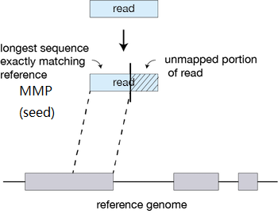

<central> 图1. MMP的定义示意图 </central>

<central> （改编自https://hbctraining.github.io/Intro-to-rnaseq-hpc-O2/lessons/03_alignment.html） </central>

​	STAR默认从read的5'端第一个碱基开始检索MMP（可以自定义起始碱基），直到无法匹配为止，之后继续重新匹配，直到将read匹配完，如图2a所示。此外，当存在部分错配或插入/缺失时，STAR可以通过扩展MMP来允许进一步的比对，如图2b所示。另外，在一些特殊情况下（如由于技术限制所导致的质量较差的测序末端、未去除接头、污染序列），MMP的扩展也无法提高比对效果，这时会将其软剪切掉，如图2c所示。

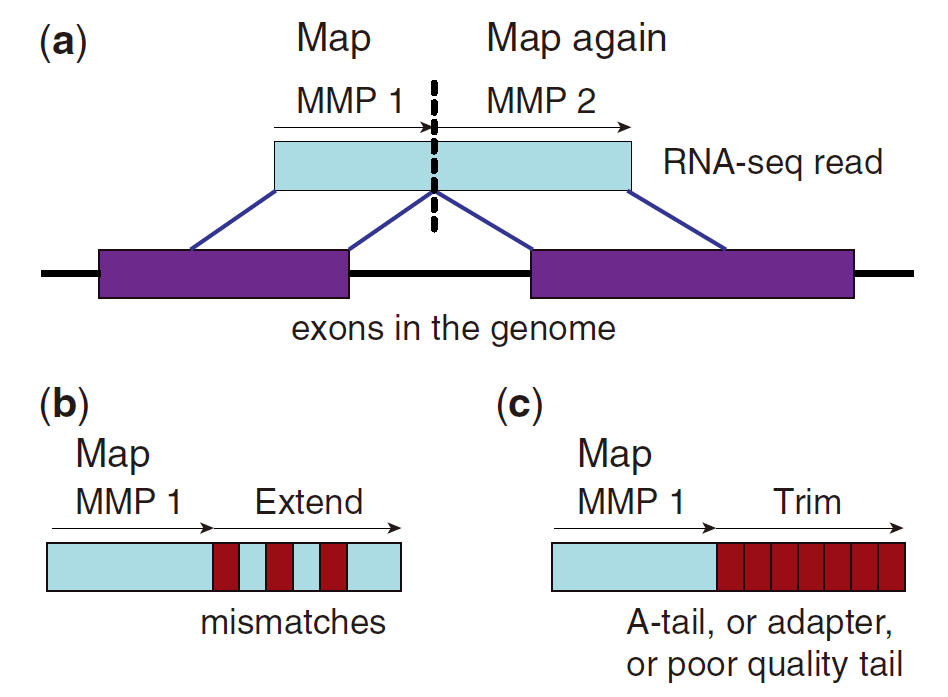

<central> 图2. STAR匹配剪接点的示意图 </central>

<central> Alexander Dobin *et al*., *Bioinformatics* (2013) </central>

#### 1.2 聚类/评分/拼接

##### 1.2.1 锚点和比对窗口

​	STAR根据与一组锚点的接近程度将种子聚类在一起。锚点是与read的长度相近的基因组区域，其长度由用户自定义（通常为20-50）。比对窗口是锚点周围的基因组区域。进行聚类时，位于比对窗口内的所有对齐片段将被连接在一起；当某个比对窗口没有完全覆盖整个read时，STAR会尝试比对两个或多个比对窗口，从而进行嵌合比对，如图3所示。

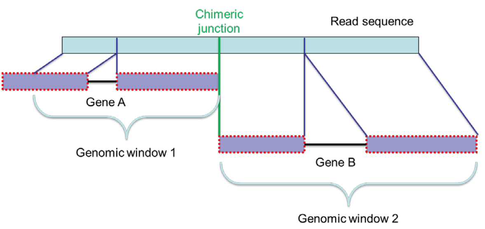

<central> 图3. 嵌合比对示意图 </central>

<central> Alexander Dobin *et al*., *Bioinformatics* (2013) </central>

##### 1.2.2 评分

​	STAR对于每个比对计算其总得分，其值为配对得分总和减去不配对（包括错配、插入、缺失和基因组间隙）得分总和，如下：
$$
S = \sum_{match} P_{m} - \sum_{mismatch} P_{mm} - \sum_{insertion} P_{ins} - \sum_{deletion} P_{del} - \sum_{gap} P_{gap}
$$
​	其中，基因组间隙惩罚可以由用户根据所研究物种中不同内含子基序的频率来确定对不同内含子基序的惩罚，默认惩罚适用于哺乳动物，以规范内含子基序GT/AG为主导，其次是GC/AG、AT/AC等其他基序。

##### 1.2.3 拼接

​	STAR使用下面的算法将两个“种子”连接起来，该算法允许一个基因组间隙和对个碱基错配：

$$
\max _{r_1<r_j<r_2}\left\{\sum_{r=1}^{r_j-r_1}\left[\begin{array}{cc}
1 & \text { if } R\left(r_1+r\right)=G\left(g_1+r\right) \& R\left(r_1+r\right) \neq G\left(g_1+r+\Delta\right) \\
-1 & \text { if } R\left(r_1+r\right) \neq G\left(g_1+r\right) \& R\left(r_1+r\right)=G\left(g_1+r+\Delta\right) \\
0 & \text { otherwise }
\end{array}\right]-P_{\text {gap }}\left(r_j\right)\right\}
$$

### 2. 数据准备

​	酿酒酵母（Saccharomyces cerevisiae）是一种常用的真核模式生物，其基因组大小约为12 Mb，含有约6000个基因，基因组较小，比较适合本次练习目的。

#### 2.1 基因组序列和注释信息获取

```bash
# 从ENSEMBL Genomes项目的FTP站点下载酿酒酵母基因组序列和注释信息
xuyinan@xlinux:~/shengxing/Lvjihong/STAR_homework/$ wget -c https://ftp.ensemblgenomes.ebi.ac.uk/pub/fungi/release-51/fasta/saccharomyces_cerevisiae/dna/Saccharomyces_cerevisiae.R64-1-1.dna.toplevel.fa.gz
xuyinan@xlinux:~/shengxing/Lvjihong/STAR_homework/$ wget -c https://ftp.ensemblgenomes.ebi.ac.uk/pub/fungi/release-51/gtf/saccharomyces_cerevisiae/Saccharomyces_cerevisiae.R64-1-1.51.gtf.gz
```

* 不同基因组文件的区别：
  * .dna.toplevel.fa.gz：包含了完整的染色体DNA序列。
  * .dna_rm.toplevel.fa.gz：将染色体DNA序列中的已知的重复序列（如转座子和假基因）标记为“N”，可以减少基因组分析中的噪音和假阳性。
  * .dna_sm.toplevel.fa.gz：去除线粒体DNA序列的染色体序列。

#### 2.2 RNAseq数据获取

​	从NCBI的Sequence Read Archive（SRA）项目下载测序数据，检索及选择过程如下：

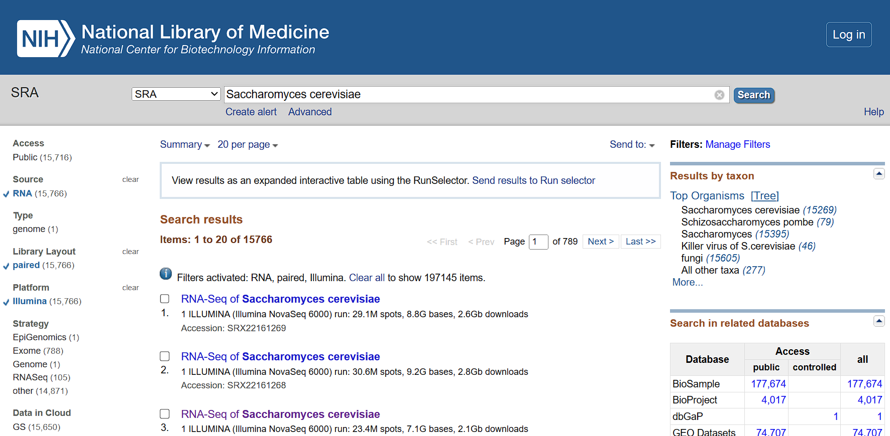

<central> 图4. NCBI检索结果 </central>

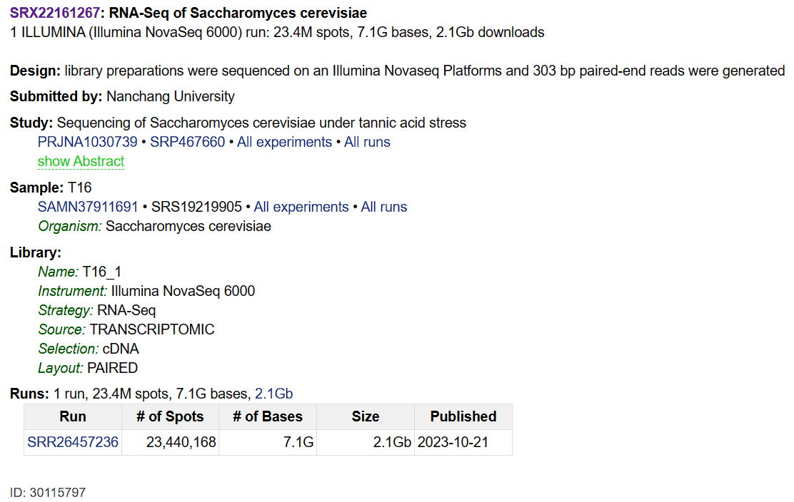

<central> 图5. 数据概览 </central>

#### 2.3 将SRA数据转换为FASTQ格式

```bash
xuyinan@xlinux:~/shengxing/Lvjihong/STAR_homework/$ sudo apt install sra-toolkit
# 进行转换
xuyinan@xlinux:~/shengxing/Lvjihong/STAR_homework/$fasterq-dump  -p -e 8 --split-3 -O . SRR26457236
```

>  相关参数作用：
>
> ​	-p：显示进程；
>
> ​	-e：使用线程数；
>
> ​	--split-3：将双端测序分为两份放在不同的文件中，并将一方有而一方没有的reads单独放在一个文件夹里。

​	查看双端测序FASTQ文件内容：


```bash
xuyinan@xlinux:~/shengxing/Lvjihong/STAR_homework/fastq$ cat SRR26457236_1.fastq |head -8
```
```
@SRR26457236.1 A00153:1009:H52FKDSX3:4:1101:2031:1000 length=151
GNGGTTGAAAAATATGATGTCACAAGAGGAACAGATCCTCATCGTGTTGAAGCAGAATACGGTAATCAAGGTGCTGACTTTAAAGGGGCAGCTACTGAAGATCGGAAGAGCACACGTCTGAACTCCAGTCACGAACATCGATCTCGTATTC
+SRR26457236.1 A00153:1009:H52FKDSX3:4:1101:2031:1000 length=151
F#FFFFFFFFFFFFFFFFFFFFFFFFFFFFFFFFFFFFFFFFFFFFFFF:FFFFFFFFFFFFF:FFFFFFFFFFFFFFFFFFFFFFFFFFFFFFFFFFFFFFFFFFFFFFFFFFFFFFFFFFFFFFFFFFFFFFFFFFFFFFF:FF,:F,:
@SRR26457236.2 A00153:1009:H52FKDSX3:4:1101:3513:1000 length=151
ANGGGGACGATGATTACAACAAGCAATATGATGATTACTAAAGCCAGACACATCTTCATTTTTAGATCCTTGTACCACATGGCTTTTCTGACCCTATTGGCACCCCTCTTAAAGCCTTGGGCTGAGACCGCTAGGTTATCGGCTTTATCTT
+SRR26457236.2 A00153:1009:H52FKDSX3:4:1101:3513:1000 length=151
F#FFFFFFFFFFF:FF:FFFFF:FFFFFFFFFFFFFFFFFFFFFFFFFFFF,FFFFFF:FFFFFF:FFFFFFFF:FFFF:,FFFFF:FF:FF:FFF,,FFFFFF,F:FF:FFFFFFF,:FFFFFFFFFFFFFFFF:FFFF:FFFFFFFFFF
```


#### 2.4 数据质量控制

```bash
# 使用FastQC可视化数据质量
xuyinan@xlinux:~/shengxing/Lvjihong/STAR_homework/fastq$ fastqc -t 12 SRR26457236_1.fastq
xuyinan@xlinux:~/shengxing/Lvjihong/STAR_homework/fastq$ fastqc -t 12 SRR26457236_1.fastq
```

> -t: 线程数


<central> 图6. 测序文件FastQC质控总结 </central>

​	由FastQC Report可知，测序数据的整体质量较好（图6、图7），但是接头含量较高，需要进一步去除（图8）。

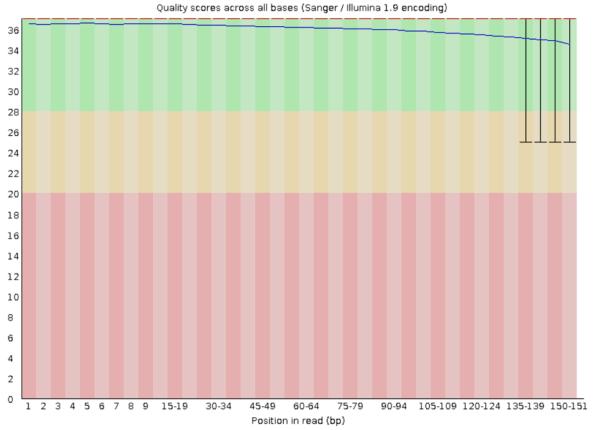

<central> 图7. 每个位置的测序质量 </central>

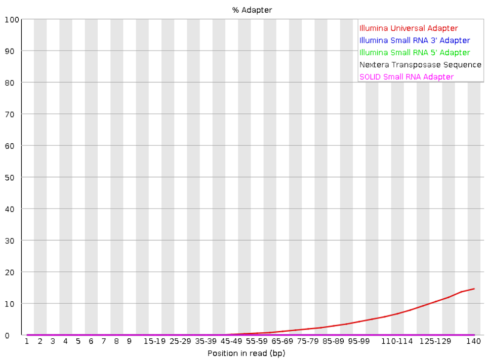

<central> 图8. 接头比例 </central>

```bash
# 去除接头
xuyinan@xlinux:~/shengxing/Lvjihong/STAR_homework/fastq$ mkdir ../output_trim
xuyinan@xlinux:~/shengxing/Lvjihong/STAR_homework/fastq$ trim_galore --paired --fastqc --output_dir ./output_trim ./fastq/SRR26457236_1.fastq ./fastq/SRR26457236_2.fastq
```
​	由下图可见，接头去除效果良好。

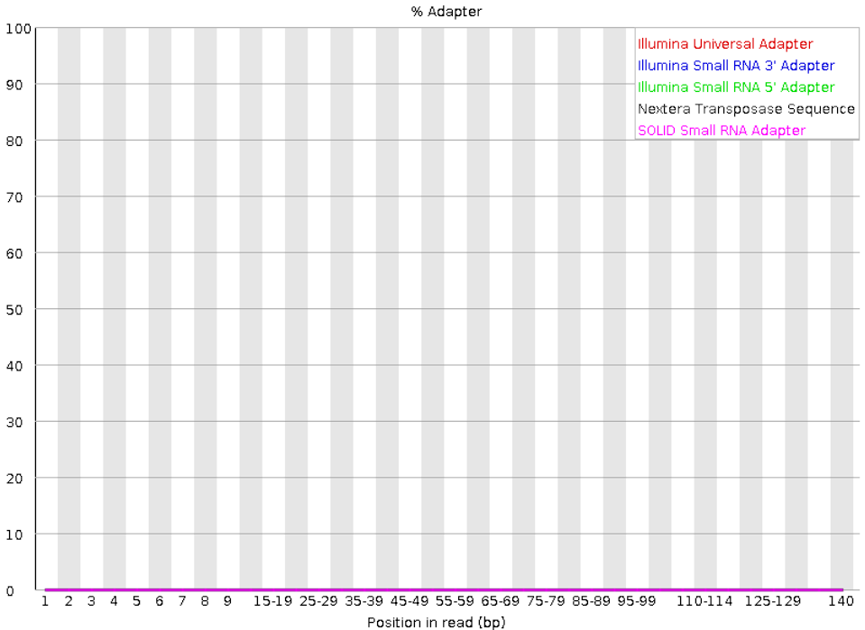

<central> 图9. 处理后接头比例 </central>

#### 2.5 安装STAR

```bash
xuyinan@xlinux:~/shengxing/Lvjihong/STAR_homework$ sudo apt-get update
xuyinan@xlinux:~/shengxing/Lvjihong/STAR_homework$ sudo apt-get install g++
xuyinan@xlinux:~/shengxing/Lvjihong/STAR_homework$ sudo apt-get install make
```

```bash
#查看帮助文档
xuyinan@xlinux:~/shengxing/Lvjihong/STAR_homework$ STAR --help
```
```
Usage: STAR  [options]... --genomeDir /path/to/genome/index/   --readFilesIn R1.fq R2.fq
Spliced Transcripts Alignment to a Reference (c) Alexander Dobin, 2009-2020

STAR version=2.7.10a
STAR compilation time,server,dir=2022-01-16T16:35:44+00:00 <place not set in Debian package>
For more details see:
<https://github.com/alexdobin/STAR>
<https://github.com/alexdobin/STAR/blob/master/doc/STARmanual.pdf>

	### versions

versionGenome           2.7.4a
    string: earliest genome index version compatible with this STAR release. Please do not change this value!

	 ### Parameter Files

parametersFiles          -
    string: name of a user-defined parameters file, "-": none. Can only be defined on the command line.

	### System

sysShell            -
    string: path to the shell binary, preferably bash, e.g. /bin/bash.

	... the default shell is executed, typically /bin/sh. This was reported to fail on some Ubuntu systems - then you need to specify path to bash.

	 ### Run Parameters

runMode                         alignReads
    string: type of the run.
                                alignReads             ... map reads
                                genomeGenerate         ... generate genome files
                                inputAlignmentsFromBAM ... input alignments from BAM. Presently only works with --outWigType and --bamRemoveDuplicates options.
                                liftOver               ... lift-over of GTF files (--sjdbGTFfile) between genome assemblies using chain file(s) from --genomeChainFiles.
                                soloCellFiltering  </path/to/raw/count/dir/>   </path/to/output/prefix>    ... STARsolo cell filtering ("calling") without remapping, followed by the path to raw count directory and output (filtered) prefix

runThreadN                      1
    int: number of threads to run STAR

runDirPerm                      User_RWX
    string: permissions for the directories created at the run-time.
                                User_RWX ... user-read/write/execute
                                All_RWX  ... all-read/write/execute (same as chmod 777)
...
```

### 3 数据比对

#### 3.1 建立索引

```bash
xuyinan@xlinux:~/shengxing/Lvjihong/STAR_homework$ gunzip Saccharomyces_cerevisiae.R64-1-1.51.gtf.gz
xuyinan@xlinux:~/shengxing/Lvjihong/STAR_homework$ gunzip Saccharomyces_cerevisiae.R64-1-1.dna.toplevel.fa.gz

xuyinan@xlinux:~/shengxing/Lvjihong/STAR_homework$ mkdir ./Sac_R64_index

STAR --runThreadN 16 \
--runMode genomeGenerate \
--genomeDir Sac_R64_index \
--genomeFastaFiles ./Saccharomyces_cerevisiae.R64-1-1.dna.toplevel.fa \
--sjdbGTFfile ./Saccharomyces_cerevisiae.R64-1-1.51.gtf \
--sjdbOverhang 99 \
--genomeSAindexNbases 10
```

> --runThreadN：设置线程数
>
> --runMode genomeGenerate：设置模式为构建索引
>
> --genomedDir：索引文件存放路径 
>
> --genomeFastaFiles：基因组fasta文件路径（支持多文件路径）
>
> --sjdbGTFfile：基因组注释文件gtf文件路径
>
> --sjdbOverhang：【默认值是100，足以应对大多数情况】
>
> --genomeSAindexNbases：

```
xuyinan@xlinux:~/shengxing/Lvjihong/STAR_homework/Sac_R64_index$ ll -h
```
```
total 118M
drwxrwxr-x 2 xuyinan xuyinan 4.0K 10月 25 21:40 ./
drwxr-xr-x 5 xuyinan xuyinan 4.0K 10月 25 21:52 ../
-rw-rw-r-- 1 xuyinan xuyinan  122 10月 25 21:39 chrLength.txt
-rw-rw-r-- 1 xuyinan xuyinan  181 10月 25 21:39 chrNameLength.txt
-rw-rw-r-- 1 xuyinan xuyinan   59 10月 25 21:39 chrName.txt
-rw-rw-r-- 1 xuyinan xuyinan  143 10月 25 21:39 chrStart.txt
-rw-rw-r-- 1 xuyinan xuyinan 207K 10月 25 21:39 exonGeTrInfo.tab
-rw-rw-r-- 1 xuyinan xuyinan  64K 10月 25 21:39 exonInfo.tab
-rw-rw-r-- 1 xuyinan xuyinan 202K 10月 25 21:39 geneInfo.tab
-rw-rw-r-- 1 xuyinan xuyinan  15M 10月 25 21:40 Genome
-rw-rw-r-- 1 xuyinan xuyinan  796 10月 25 21:40 genomeParameters.txt
-rw-rw-r-- 1 xuyinan xuyinan 7.4K 10月 25 21:40 Log.out
-rw-rw-r-- 1 xuyinan xuyinan  97M 10月 25 21:40 SA
-rw-rw-r-- 1 xuyinan xuyinan 5.9M 10月 25 21:40 SAindex
-rw-rw-r-- 1 xuyinan xuyinan 8.8K 10月 25 21:40 sjdbInfo.txt
-rw-rw-r-- 1 xuyinan xuyinan 8.7K 10月 25 21:39 sjdbList.fromGTF.out.tab
-rw-rw-r-- 1 xuyinan xuyinan 6.9K 10月 25 21:40 sjdbList.out.tab
-rw-rw-r-- 1 xuyinan xuyinan 359K 10月 25 21:39 transcriptInfo.tab
```

#### 3.2 将FASTQ文件比对到参考基因组

##### 3.2.1 完整RNAseq数据比对（失败）

```bash
xuyinan@xlinux:~/shengxing/Lvjihong/STAR_homework$ mkdir Sac_R64_mapping
xuyinan@xlinux:~/shengxing/Lvjihong/STAR_homework$ cd ./Sac_R64_mapping

STAR --runThreadN 16 \
--genomeDir ./Sac_R64_index \
--outSAMtype BAM SortedByCoordinate \
--outReadsUnmapped Fastx  \
--quantMode GeneCounts TranscriptomeSAM  \
--twopassMode Basic  \
--readFilesIn ./output_trim/SRR26457236_1_val_1.fq ./output_trim/SRR26457236_2_val_2.fq \
--outFileNamePrefix ./SRR26457236  \
--outFilterType BySJout 
```

>--runThreadN：设置线程数
>
>--genomedDir：参考基因组索引文件存放路径 
>
>--outSAMtype：设置输出文件格式，本次输出经过坐标排序的BAM文件
>
>--outReadsUnmapped：输出没能比对到基因组上的序列，本次设置输出格式与输入文件相同
>
>--quantMode：输出文件类型，本次输出基因的Read Count文件以及转录本定量的SAM文件
>
>--twopassMode Basic：STAR的两次对比模式
>
>--readFilesIn：输入文件的名称
>
>--outFileNamePrefix：输出文件夹的前缀
>--outFilterType BySJout ：对可变剪切进行过滤以减少错误

```
	/usr/lib/rna-star/bin/STAR-sse4.1 --runThreadN 16 --genomeDir ./Sac_R64_index --outSAMtype BAM SortedByCoordinate --outReadsUnmapped Fastx --quantMode GeneCounts TranscriptomeSAM --twopassMode Basic --readFilesIn ./output_trim/SRR26457236_1_val_1.fq ./output_trim/SRR26457236_2_val_2.fq --outFileNamePrefix ./SRR26457236 --outFilterType BySJout
	STAR version: 2.7.10a   compiled: 2022-01-16T16:35:44+00:00 <place not set in Debian package>

Oct 25 22:36:04 ..... started STAR run
Oct 25 22:36:04 ..... loading genome
Oct 25 22:36:04 ..... started 1st pass mapping
Oct 26 00:17:07 ..... finished 1st pass mapping
Oct 26 00:17:07 ..... inserting junctions into the genome indices
Oct 26 00:17:12 ..... started mapping
Oct 26 02:02:50 ..... finished mapping
Oct 26 02:02:50 ..... started sorting BAM

EXITING because of fatal ERROR: not enough memory for BAM sorting: 
SOLUTION: re-run STAR with at least --limitBAMsortRAM 1331690088
Oct 26 02:02:50 ...... FATAL ERROR, exiting
```

​	可见由于内存不足，STAR无法完成比对。这是因为一方面RNAseq测序数据比较大，另一方面STAR对内存的要求较高。

##### 3.2.2 RNAseq测序数据的拆分

​	由于双端测序的配对序列顺序是一致的，如下所示，因此本练习仅取RNAseq的部分数据（约前1/100）进行比对分析：

```bash
xuyinan@xlinux:~/shengxing/Lvjihong/STAR_homework/output_trim$ cat SRR26457236_1_val_1.fq |head 
```

```
@SRR26457236.1 A00153:1009:H52FKDSX3:4:1101:2031:1000 length=151

GNGGTTGAAAAATATGATGTCACAAGAGGAACAGATCCTCATCGTGTTGAAGCAGAATACGGTAATCAAGGTGCTGACTTTAAAGGGGCAGCTACTGA
+
F#FFFFFFFFFFFFFFFFFFFFFFFFFFFFFFFFFFFFFFFFFFFFFFF:FFFFFFFFFFFFF:FFFFFFFFFFFFFFFFFFFFFFFFFFFFFFFFFF
@SRR26457236.2 A00153:1009:H52FKDSX3:4:1101:3513:1000 length=151
ANGGGGACGATGATTACAACAAGCAATATGATGATTACTAAAGCCAGACACATCTTCATTTTTAGATCCTTGTACCACATGGCTTTTCTGACCCTATTGGCACCCCTCTTAAAGCCTTGGGCTGAGACCGCTAGGTTATCGGCTTTATCTT
+
F#FFFFFFFFFFF:FF:FFFFF:FFFFFFFFFFFFFFFFFFFFFFFFFFFF,FFFFFF:FFFFFF:FFFFFFFF:FFFF:,FFFFF:FF:FF:FFF,,FFFFFF,F:FF:FFFFFFF,:FFFFFFFFFFFFFFFF:FFFF:FFFFFFFFFF
@SRR26457236.3 A00153:1009:H52FKDSX3:4:1101:4490:1000 length=151
GNTGAATTCATGTTGTTGGATGCTTTCCGTAAGGTAGAGGCTTGTGTTCATTTTTGCTTCCGCCTGCAAAAGTGGAGTCATTTTTTTTTTTTTATGAAATAAGGAGAAATAGAGTAGGGGGAAGGTGAGTAAATATAATGGGTAGAGGA
```


```bash
xuyinan@xlinux:~/shengxing/Lvjihong/STAR_homework/output_trim$ cat SRR26457236_2_val_2.fq |head 
```

```
@SRR26457236.1 A00153:1009:H52FKDSX3:4:1101:2031:1000 length=151
TCAGTAGCTGCCCCTTTAAAGTCAGCACCTTGATTACCGTATTCTGCTTCAACACGATGAGGATCTGTTCCTCTTGTGACATCATATTTTTCAACCAC
+
FFFFFFFFFFFFFFFFFFF:FFFFFFFFFFFFFFFFFFFFFFFFFFFFFFFFFFFFFFFFFFFFFFFFFFFFFFFFFFFFFFFFFFFFFFFFFFFFFF
@SRR26457236.2 A00153:1009:H52FKDSX3:4:1101:3513:1000 length=151
GCAAGCGCAACGTAAACAATGTCCATGACGTCATCTACTCCCTTTGACCCTTATGCTCTAACCGAGCACGATGAAGAACGACCCCAGAATGTACAGTCTAAGTCAAGGACTGCGGAACTACAAGCTGAAATTGATGATACCGTGGGAATA
+
FFF,F:,FFFFF:F,,FF,:,,FFFFF,,:F:FF:,FF,FF,FF,,FF,FF,F,FF,FFF,FF,F,::F,FF,F,,FF:,FFFF,F,FFF,FFFFFFFFFFFFFFFF,FFFF:F,FFF:FFFFF:FFFFFF,,FFFFFF,F:,:FFF:FF
@SRR26457236.3 A00153:1009:H52FKDSX3:4:1101:4490:1000 length=151
TGTTTATAAGGATTTTGTTCCTCGACCCCTTATATTTACTCACCTTCCCCCTACTCTAATTCTCCTGATTTCAGAACAAAAAAAAAATGACTCCACTTTTGCAGGCGGAAGCAAAAATGAACACAAGCCTCTACCTTACGGAAAGCATCC
```


```bash
#统计测序数据行数
xuyinan@xlinux:~/shengxing/Lvjihong/STAR_homework/output_trim$ cat SRR26457236_2_val_2.fq |wc -l
```

```
93510024
```


```bash
#选取前1000000行（250000 paired-end reads）进行后续分析
xuyinan@xlinux:~/shengxing/Lvjihong/STAR_homework/output_trim$ mkdir ../output_shrink
xuyinan@xlinux:~/shengxing/Lvjihong/STAR_homework/output_trim$ head -1000000 SRR26457236_1_val_1.fq > SRR26457236_1_shr.fq
xuyinan@xlinux:~/shengxing/Lvjihong/STAR_homework/output_trim$ head -1000000 SRR26457236_2_val_2.fq > SRR26457236_2_shr.fq
```

##### 3.2.3 拆分结果

```bash
xuyinan@xlinux:~/shengxing/Lvjihong/STAR_homework/output_trim$ ll -h
```

```
total 16G
drwxrwxr-x  2 xuyinan xuyinan 4.0K 10月 26 04:26 ./
drwxr-xr-x 11 xuyinan xuyinan 4.0K 10月 26 04:25 ../
-rw-rw-r--  1 xuyinan xuyinan 5.4K 10月 25 21:33 SRR26457236_1.fastq_trimming_report.txt
-rw-rw-r--  1 xuyinan xuyinan 585K 10月 25 21:51 SRR26457236_1_val_1_fastqc.html
-rw-rw-r--  1 xuyinan xuyinan 763K 10月 25 21:51 SRR26457236_1_val_1_fastqc.zip
-rw-rw-r--  1 xuyinan xuyinan 8.0G 10月 25 21:46 SRR26457236_1_val_1.fq
-rw-rw-r--  1 xuyinan xuyinan 5.5K 10月 25 21:46 SRR26457236_2.fastq_trimming_report.txt
-rw-rw-r--  1 xuyinan xuyinan 589K 10月 25 21:56 SRR26457236_2_val_2_fastqc.html
-rw-rw-r--  1 xuyinan xuyinan 771K 10月 25 21:56 SRR26457236_2_val_2_fastqc.zip
-rw-rw-r--  1 xuyinan xuyinan 8.0G 10月 25 21:46 SRR26457236_2_val_2.fq
```


```bash
xuyinan@xlinux:~/shengxing/Lvjihong/STAR_homework/output_trim$ cd ../output_shrink/
xuyinan@xlinux:~/shengxing/Lvjihong/STAR_homework/output_shrink$ ll -h
```

```
total 173M
drwxrwxr-x  2 xuyinan xuyinan 4.0K 10月 26 04:26 ./
drwxr-xr-x 11 xuyinan xuyinan 4.0K 10月 26 04:25 ../
-rw-rw-r--  1 xuyinan xuyinan  87M 10月 26 04:24 SRR26457236_1_shr.fq
-rw-rw-r--  1 xuyinan xuyinan  87M 10月 26 04:25 SRR26457236_2_shr.fq
```

​	可见，拆分后单端测序数据（87M）的大小约为原测序数据（约8G）的1/1000。

##### 3.2.4 拆分后的RNAseq数据进行比对

```bash
xuyinan@xlinux:~/shengxing/Lvjihong/STAR_homework$ STAR --runThreadN 16 \
--genomeDir ./Sac_R64_index \
--outSAMtype BAM SortedByCoordinate \
--outReadsUnmapped Fastx  \
--quantMode GeneCounts TranscriptomeSAM  \
--twopassMode Basic  \
--readFilesIn ./output_shrink/SRR26457236_1_shr.fq ./output_shrink/SRR26457236_2_shr.fq \
--outFileNamePrefix ./SRR26457236  \
--outFilterType BySJout 
```

```
	/usr/lib/rna-star/bin/STAR-sse4.1 --runThreadN 16 --genomeDir ./Sac_R64_index --outSAMtype BAM SortedByCoordinate --outReadsUnmapped Fastx --quantMode GeneCounts TranscriptomeSAM --twopassMode Basic --readFilesIn ./output_shrink/SRR26457236_1_shr.fq ./output_shrink/SRR26457236_2_shr.fq --outFileNamePrefix ./SRR26457236 --outFilterType BySJout
​	STAR version: 2.7.10a   compiled: 2022-01-16T16:35:44+00:00 <place not set in Debian package>
Oct 26 04:35:25 ..... started STAR run
Oct 26 04:35:25 ..... loading genome
Oct 26 04:35:25 ..... started 1st pass mapping
Oct 26 04:36:27 ..... finished 1st pass mapping
Oct 26 04:36:27 ..... inserting junctions into the genome indices
Oct 26 04:36:28 ..... started mapping
Oct 26 04:37:35 ..... finished mapping
Oct 26 04:37:36 ..... started sorting BAM
Oct 26 04:37:37 ..... finished successfully
```

​	比对成功。比对结果文件如下：

```bash
xuyinan@xlinux:~/shengxing/Lvjihong/STAR_homework$ ll -h
```

```
total 2.2G
drwxr-xr-x 10 xuyinan xuyinan 4.0K 10月 26 04:37 ./
drwxrwxr-x  5 xuyinan xuyinan 4.0K 10月 26 03:01 ../
-rw-rw-r--  1 xuyinan xuyinan    0 10月 25 22:31 Aligned.out.sam
drwxrwxr-x  2 xuyinan xuyinan 4.0K 10月 25 21:22 fastq/
-rw-rw-r--  1 xuyinan xuyinan  798 10月 25 22:31 Log.out
-rw-rw-r--  1 xuyinan xuyinan    0 10月 25 22:31 Log.progress.out
drwxrwxr-x  2 xuyinan xuyinan 4.0K 10月 26 04:26 output_shrink/
drwxrwxr-x  2 xuyinan xuyinan 4.0K 10月 26 04:26 output_trim/
-rwxr-xr-x  1 xuyinan xuyinan 9.2M 10月 25 18:48 Saccharomyces_cerevisiae.R64-1-1.51.gtf*
-rwxr-xr-x  1 xuyinan xuyinan  12M 10月 25 18:48 Saccharomyces_cerevisiae.R64-1-1.dna.toplevel.fa*
drwxrwxr-x  2 xuyinan xuyinan 4.0K 10月 25 22:12 Sac_R64_index/
drwxrwxr-x  2 xuyinan xuyinan 4.0K 10月 25 22:05 Sac_R64_mapping/
-rwxr-xr-x  1 xuyinan xuyinan 2.1G 10月 25 18:51 SRR26457236*
-rw-rw-r--  1 xuyinan xuyinan  22M 10月 26 04:37 SRR26457236Aligned.sortedByCoord.out.bam
-rw-rw-r--  1 xuyinan xuyinan  23M 10月 26 04:37 SRR26457236Aligned.toTranscriptome.out.bam
-rw-rw-r--  1 xuyinan xuyinan 2.0K 10月 26 04:37 SRR26457236Log.final.out
-rw-rw-r--  1 xuyinan xuyinan  18K 10月 26 04:37 SRR26457236Log.out
-rw-rw-r--  1 xuyinan xuyinan  565 10月 26 04:37 SRR26457236Log.progress.out
-rw-rw-r--  1 xuyinan xuyinan 109K 10月 26 04:37 SRR26457236ReadsPerGene.out.tab
-rw-rw-r--  1 xuyinan xuyinan  11K 10月 26 04:37 SRR26457236SJ.out.tab
drwx------  2 xuyinan xuyinan 4.0K 10月 26 04:36 SRR26457236_STARgenome/
drwx------  2 xuyinan xuyinan 4.0K 10月 26 04:36 SRR26457236_STARpass1/
-rw-rw-r--  1 xuyinan xuyinan 4.8M 10月 26 04:37 SRR26457236Unmapped.out.mate1
-rw-rw-r--  1 xuyinan xuyinan 4.8M 10月 26 04:37 SRR26457236Unmapped.out.mate2
drwx------  2 xuyinan xuyinan 4.0K 10月 25 22:31 _STARtmp/
```


#### 3.3 比对结果文件解读

##### 3.3.1 剪切文件

​	比对结果中```SRR26457236SJ.out.tab```是剪切文件，包含从内含子开始计算的高可信度的剪切事件，其部分内容如下：

```bash
xuyinan@xlinux:~/shengxing/Lvjihong/STAR_homework$ cat SRR26457236SJ.out.tab |head
```

```
I	12536	12823	1	1	1	0	2	48
I	87388	87500	1	1	1	20	0	75
I	139559	139582	2	2	1	14	0	71
I	142254	142619	1	1	1	50	2	74
I	151007	151096	2	2	1	1	0	75
II	45645	45977	1	1	1	94	0	62
II	45645	46001	1	1	1	1	0	23
II	46987	47146	2	2	1	1	0	22
II	47059	47146	2	2	1	1	0	15
II	60194	60697	2	2	1	25	0	71
```

其中，从左至右各列含义为：

​	染色体编号；

​	内含子的第一个碱基；

​	内含子的最后一个碱基；

​	正负链（0：未定义；1：+；2：-）；

​	内含子剪切模式（0：非经典；1：GT/AG；2：CT/AC；3：GC/AG；4：CT/GC；5：AT/AC；6：GT/AT）

​	内含子注释信息（0：未注释；1：已注释）

​	单次比对的读段跨越剪切区域的数量；

​	多重比对的读段跨越剪切区域的数量；

​	比对到的读段与剪切点的最远延伸距离。

##### 3.3.2 日志文件

​	日志文件记录在程序运行过程中的各种状态以及异常，比对结果有3个日志文件：```SRR26457236Log.out``` 、```SRR26457236Log.progress.out```和 ```SRR26457236Log.final.out```。其中：

​	```SRR26457236Log.out``` 是主日志文件，主要用于故障排除和调试；

​	```SRR26457236Log.progress.out```每隔1min更新一次，主要记载的是程序进程;

​	```SRR26457236Log.final.out```在比对完成之后对结果进行总结，可以用于质控。

​	查看结果总结日志文件：

```bash
xuyinan@xlinux:~/shengxing/Lvjihong/STAR_homework$ cat SRR26457236Log.final.out 
```

```
                                 Started job on |	Oct 26 04:35:25
                             Started mapping on |	Oct 26 04:36:28
                                    Finished on |	Oct 26 04:37:37
       Mapping speed, Million of reads per hour |	13.04

                          Number of input reads |	250000
                      Average input read length |	286
                                    UNIQUE READS:
                   Uniquely mapped reads number |	227041
                        Uniquely mapped reads % |	90.82%
                          Average mapped length |	284.23
                       Number of splices: Total |	8305
            Number of splices: Annotated (sjdb) |	8303
                       Number of splices: GT/AG |	7148
                       Number of splices: GC/AG |	58
                       Number of splices: AT/AC |	3
               Number of splices: Non-canonical |	1096
                      Mismatch rate per base, % |	0.49%
                         Deletion rate per base |	0.01%
                        Deletion average length |	2.36
                        Insertion rate per base |	0.01%
                       Insertion average length |	1.97
                             MULTI-MAPPING READS:
        Number of reads mapped to multiple loci |	7651
             % of reads mapped to multiple loci |	3.06%
        Number of reads mapped to too many loci |	220
             % of reads mapped to too many loci |	0.09%
                                  UNMAPPED READS:
  Number of reads unmapped: too many mismatches |	0
       % of reads unmapped: too many mismatches |	0.00%
            Number of reads unmapped: too short |	15068
                 % of reads unmapped: too short |	6.03%
                Number of reads unmapped: other |	20
                     % of reads unmapped: other |	0.01%
                                  CHIMERIC READS:
                       Number of chimeric reads |	0
                            % of chimeric reads |	0.00%
```

​	可见，```SRR26457236Log.final.out```文件对unique reads、multi-mapping reads、ummapping reads以及chimeric reads分别进行了总结。可以看到，绝大部分序列可以直接匹配到基因组的单个位置（90.82%），少数序列有多个匹配位置（3.15%）或因太短而无法匹配（6.03%），没有嵌合序列。

##### 3.3.3 比对文件

比对结果的主要信息存放在两个BAM文件中：```SRR26457236Aligned.sortedByCoord.out.bam```和```SRR26457236Aligned.toTranscriptome.out.bam```。我们首先查看```SRR26457236Aligned.sortedByCoord.out.bam```文件内容：

```bash
#首先将BAM文件转换为SAM文件
xuyinan@xlinux:~/shengxing/Lvjihong/STAR_homework$ samtools view -h  -o SRR26457236Aligned.sortedByCoord.out.sam SRR26457236Aligned.sortedByCoord.out.bam

xuyinan@xlinux:~/shengxing/Lvjihong/STAR_homework$ cat SRR26457236Aligned.sortedByCoord.out.sam |head -25
```

> -h: 保留BAM文件的头部信息
>
> -o: 输出格式

```
@HD	VN:1.4	SO:coordinate
@SQ	SN:I	LN:230218
@SQ	SN:II	LN:813184
@SQ	SN:III	LN:316620
@SQ	SN:IV	LN:1531933
@SQ	SN:V	LN:576874
@SQ	SN:VI	LN:270161
@SQ	SN:VII	LN:1090940
@SQ	SN:VIII	LN:562643
@SQ	SN:IX	LN:439888
@SQ	SN:X	LN:745751
@SQ	SN:XI	LN:666816
@SQ	SN:XII	LN:1078177
@SQ	SN:XIII	LN:924431
@SQ	SN:XIV	LN:784333
@SQ	SN:XV	LN:1091291
@SQ	SN:XVI	LN:948066
@SQ	SN:Mito	LN:85779
@PG	ID:STAR	PN:STAR	VN:2.7.10a	CL:/usr/lib/rna-star/bin/STAR-sse4.1   --runThreadN 16   --genomeDir ./Sac_R64_index   --readFilesIn ./output_shrink/SRR26457236_1_shr.fq   ./output_shrink/SRR26457236_2_shr.fq      --outFileNamePrefix ./SRR26457236   --outReadsUnmapped Fastx   --outSAMtype BAM   SortedByCoordinate      --outFilterType BySJout   --quantMode GeneCounts   TranscriptomeSAM      --twopassMode Basic
@PG	ID:samtools	PN:samtools	PP:STAR	VN:1.13	CL:samtools view -h -o SRR26457236Aligned.sortedByCoord.out.sam SRR26457236Aligned.sortedByCoord.out.bam
@CO	user command line: /usr/lib/rna-star/bin/STAR-sse4.1 --runThreadN 16 --genomeDir ./Sac_R64_index --outSAMtype BAM SortedByCoordinate --outReadsUnmapped Fastx --quantMode GeneCounts TranscriptomeSAM --twopassMode Basic --readFilesIn ./output_shrink/SRR26457236_1_shr.fq ./output_shrink/SRR26457236_2_shr.fq --outFileNamePrefix ./SRR26457236 --outFilterType BySJout
SRR26457236.10866	163	I	429	255	47M5D103M	=	438	164	CACACGGATGCTACAGTATATACCATCTCAAACTTACCCTACTCTCACACTCCAATCCATGGCCCATCTCTCACTAAATCAGTACTAGATGCACTCACATCATTATGCACGGCACTTGCCTCAGCGGTCTATACCCTGTGCCATTTACCC	FFFFFFFFFFFFFFFFFFFFFFFFFFFFFFFFFFFFFFFFFFFFFFFFFFFFFFFFFFFFFFFFFFFFFFFFFFFFFFFFFFFFFFFFFFFFFFFFFFFFFFFFFFFFFFFFFFFFFFFFFFFFFFFFFFFFFFFFFFFFFFFFFFFFFF	NH:i:1	HI:i:1	AS:i:254	nM:i:10
SRR26457236.10866	83	I	438	255	38M5D112M	=	429	-164	GCTACAGTATATACCATCTCAAACTTACCCTACTCTCACACTCCAATCCATGGCCCATCTCTCACTAAATCAGTACTAGATGCACTCACATCATTATGCACGGCACTTGCCTCAGCGGTCTATACCCTGTGCCATTTACCCATAACGCCC	FFFFFFFFFFFFFF:FFF,FFFFFFFFFFFFFFFFFFFFFFF:FFFFFFFFFFFFFF:FFFFFFFFFFFFFFFFFFFFFFFFFFFFFFFFFFFFFFFFFFFFFFFFFFFFFFFFFFFFFFFFFFFFFFFFFFFFFFFFFFFFFFFFFFFF	NH:i:1	HI:i:1	AS:i:254	nM:i:10
SRR26457236.156633	99	I	4068	255	1S150M	=	4216	309	GTGAGGCAACCGTCGACAACCTTATTATCGAAAAAGAACAACAAGTTCACATACTTGTTACTCTCTATAACCAGAGAGTACTTTTTTTGGAAGCAAGTAAGAATAAGTCAATTTCTACTTACCTCATTAGGGAAAAATTTAATAGCAGTTG	FFFFFFFFFFFFFFFFFFFFF:FF:FFFFFFFFFFFFFFFFFF:FFFFFFFFFFFFFFFFFFFFFFFFFFFFFFFFFFFFFFFFFFFFFFFFFFFFFFFFFF:FFFFFFFFFFFFFFFFFFFFFFF:FFFFFFFFF:FFFFFFFFFFFFFF	NH:i:1	HI:i:1	AS:i:270	nM:i:2
SRR26457236.159890	99	I	4068	255	1S150M	=	4216	309	GTGAGGCAACCGTCGACAACCTTATTATCGAAAAAGAACAACAAGTTCACATACTTGTTACTCTCTATAACCAGAGAGTACTTTTTTTGGAAGCAAGTAAGAATAAGTCAATTTCTACTTACCTCATTAGGGAAAAATTTAATAGCAGTTG	:FF:FFFF,FFFFFFFFFFFFF:FFFFFFFFFF:FFFFFFFFFFFFFFFFFFFFFFFFFFFFFFFFFFFFFFFFFFFF:FFFFFFFFF:FFFFFFFF:FFFFFFFFFFFFFFFFFFFFFFFF:FFF,FFF:FFFFFFFFFFFFFF:FFFFF	NH:i:1	HI:i:1	AS:i:270	nM:i:2
```

文件可以分为两部分：以“@”开头的头部信息和比对信息。头部信息中：

​	@HD：该SAM文件的版本和排序方式，本练习“@HD	VN:1.4	SO:coordinate”表示1.4版SAM文件，按照比对信息的名称（RNAME）排序。

​	@SQ：比对使用的参考基因组信息。如本练习“@SQ	SN:I	LN:230218”表示使用了考基因组I号染色体，其长度为230218bp。

​	@PG：产生比对结果的软件和命令行信息。如本练习“@PG	ID:STAR	PN:STAR	VN:2.7.10a	CL:/usr/lib/rna-star/bin/STAR-sse4.1   --runThreadN 16   --genomeDir ./Sac_R64_index   --readFilesIn ./output_shrink/SRR26457236_1_shr.fq   ./output_shrink/SRR26457236_2_shr.fq      --outFileNamePrefix ./SRR26457236   --outReadsUnmapped Fastx   --outSAMtype BAM   SortedByCoordinate      --outFilterType BySJout   --quantMode GeneCounts   TranscriptomeSAM      --twopassMode Basic”表示使用STAR (2.7.10a) 软件，用“CL”中的命令行进行地比对。

​	@CO：其他注释信息。

​	返回值中比对信息整理如下：

|       QNAME        | FLAG | RNAME | POS  | MAPQ |   CIGAR   | RNEXT | PNEXT | TLEN |                             SEQ                              |                             QUAL                             | Optional fields |        |          |         |
| :----------------: | :--: | :---: | ---- | :--: | :-------: | :---: | :---: | :--: | :----------------------------------------------------------: | :----------------------------------------------------------: | :-------------: | :----: | :------: | :-----: |
| SRR26457236.10866  | 163  |   I   | 429  | 255  | 47M5D103M |   =   |  438  | 164  | CACACGGATGCTACAGTATATACCATCTCAAACTTACCCTACTCTCACACTCCAATCCATGGCCCATCTCTCACTAAATCAGTACTAGATGCACTCACATCATTATGCACGGCACTTGCCTCAGCGGTCTATACCCTGTGCCATTTACCC | FFFFFFFFFFFFFFFFFFFFFFFFFFFFFFFFFFFFFFFFFFFFFFFFFFFFFFFFFFFFFFFFFFFFFFFFFFFFFFFFFFFFFFFFFFFFFFFFFFFFFFFFFFFFFFFFFFFFFFFFFFFFFFFFFFFFFFFFFFFFFFFFFFFFFF |     NH:i:1      | HI:i:1 | AS:i:254 | nM:i:10 |
| SRR26457236.10866  |  83  |   I   | 438  | 255  | 38M5D112M |   =   |  429  | -164 | GCTACAGTATATACCATCTCAAACTTACCCTACTCTCACACTCCAATCCATGGCCCATCTCTCACTAAATCAGTACTAGATGCACTCACATCATTATGCACGGCACTTGCCTCAGCGGTCTATACCCTGTGCCATTTACCCATAACGCCC |                      FFFFFFFFFFFFFF:FFF                      |                 |        |          |         |
| SRR26457236.156633 |  99  |   I   | 4068 | 255  |  1S150M   |   =   | 4216  | 309  | GTGAGGCAACCGTCGACAACCTTATTATCGAAAAAGAACAACAAGTTCACATACTTGTTACTCTCTATAACCAGAGAGTACTTTTTTTGGAAGCAAGTAAGAATAAGTCAATTTCTACTTACCTCATTAGGGAAAAATTTAATAGCAGTTG | FFFFFFFFFFFFFFFFFFFFF:FF:FFFFFFFFFFFFFFFFFF:FFFFFFFFFFFFFFFFFFFFFFFFFFFFFFFFFFFFFFFFFFFFFFFFFFFFFFFFFF:FFFFFFFFFFFFFFFFFFFFFFF:FFFFFFFFF:FFFFFFFFFFFFFF |     NH:i:1      | HI:i:1 | AS:i:270 | nM:i:2  |
| SRR26457236.159890 |  99  |   I   | 4068 | 255  |  1S150M   |   =   | 4216  | 309  | GTGAGGCAACCGTCGACAACCTTATTATCGAAAAAGAACAACAAGTTCACATACTTGTTACTCTCTATAACCAGAGAGTACTTTTTTTGGAAGCAAGTAAGAATAAGTCAATTTCTACTTACCTCATTAGGGAAAAATTTAATAGCAGTTG |                           :FF:FFFF                           |                 |        |          |         |

​	各列含义如下图所示：

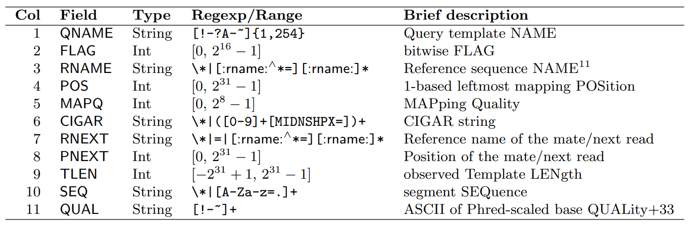

<central> 图10. 比对文件各列含义 </central>

<central> （图片来源：http://samtools.sourceforge.net/SAM1.pdf ）</central> 

​	其中，FLAG、MAPQ和CIGAR的详细含义如下：

（1）FLAG

​	FLAG是对比对情况的详细描述，其值是下图中“Bit”的单个值或多个值的和，代表下图中“Description”中的意义。对于多个值的和，有多个网站可以进行拆分，如[Explain SAM Flags (broadinstitute.github.io)](https://broadinstitute.github.io/picard/explain-flags.html)。以返回值的第一条序列为例，其FLAG=163，拆分后表示“read paired, read mapped in proper pair, mate reverse strand, second in pair”，如图12所示。

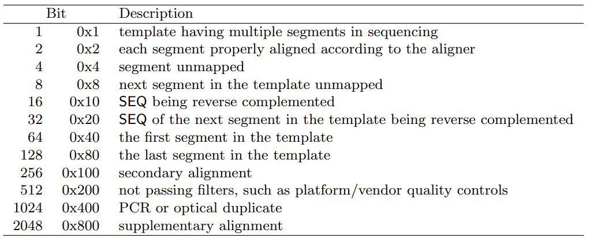

<central> 图11. FLAG的含义 </central>

<central> （图片来源：http://samtools.sourceforge.net/SAM1.pdf ）</central> 

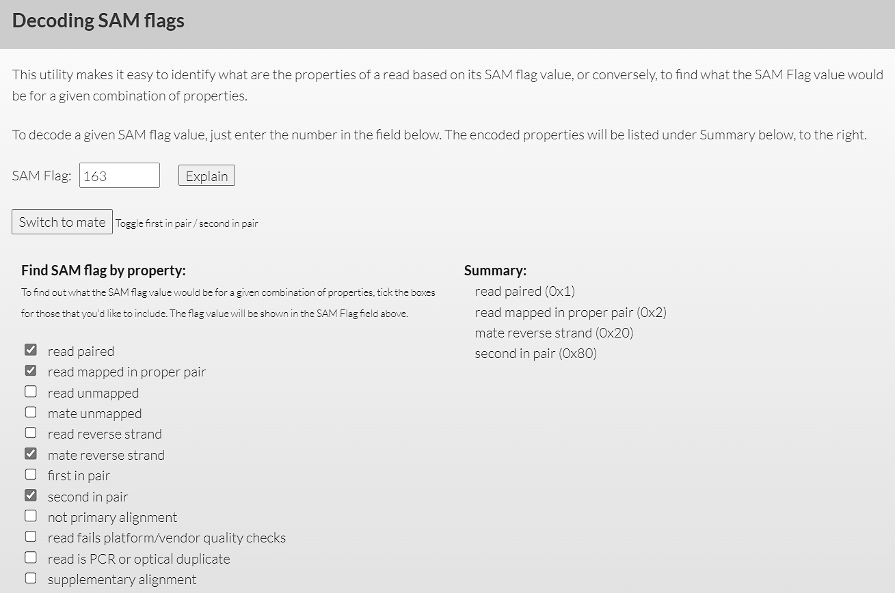

<central> 图12. Explain SAM Flags网站对FLAG=163的解释 </central>

（2）MAPQ

​	MAPQ是“Mapping Quality”的简称，其定义为：
$$
MAPQ=-10 * log10 {Pr}
$$
​	其中，Pr为匹配出错的概率。因此，MAPQ越大，相应的匹配出错的概率越小。本练习返回值中MAPQ均为255，官方文档说明为“A value 255 indicates that the mapping quality is not available”。

（3）CIGAR

​	CIGAR是Compact Idiosyncratic Gapped Alignment Representation的简写，描述read与参考序列的比对具体情况信息。例如，CIGAR=3M1D2M1I1M，表示：3个碱基匹配（M)（3M）、接下来1个碱基缺失（D）、接下来2个匹配（2M）、接下来1个碱基插入（1I）、接下来1个碱基匹配（1M）。其符号含义如下图所示。

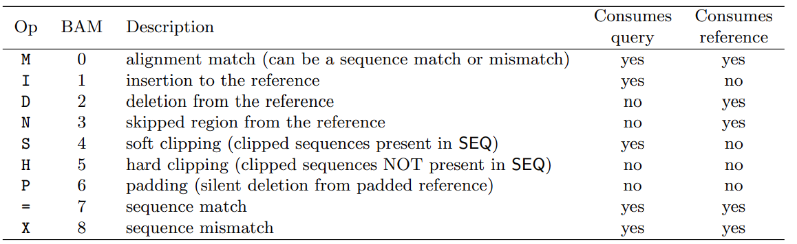

<central> 图13. CIGAR中符号的含义 </central>

<central> （图片来源：http://samtools.sourceforge.net/SAM1.pdf ）</central> 


​	另外，我们来查看```SRR26457236Aligned.toTranscriptome.out.bam```文件内容：

```bash
#将BAM文件转换为SAM文件
xuyinan@xlinux:~/shengxing/Lvjihong/STAR_homework$ samtools view -h -@ 10  -o SRR26457236Aligned.toTranscriptome.out.sam SRR26457236Aligned.toTranscriptome.out.bam 

xuyinan@xlinux:~/shengxing/Lvjihong/STAR_homework$ cat SRR26457236Aligned.toTranscriptome.out.sam
```

```
@SQ	SN:YAL069W_mRNA	LN:315
@SQ	SN:YAL068W-A_mRNA	LN:255
@SQ	SN:YAL068C_mRNA	LN:363
@SQ	SN:YAL067W-A_mRNA	LN:228
@SQ	SN:YAL067C_mRNA	LN:1782
@SQ	SN:YAL066W_mRNA	LN:309
...
SRR26457236.231995	147	YGL196W_mRNA	637	255	151M	=	611	-177	ACCTCGATCAACGACACTCAGAATCTTTTGATGGAAGAAGTGAAAGCAGTCAATTCTGCCGCTAAAGTTTTGTGCTCTGTGGATCCTCAGTTTGATCCTTCTAAATTAACACTTTCTGTGGGCGCTACTCCGACTTCCAATTCCTTGAAAC	FFFFFFFFFFFFFFFFFFFFFFFFFFFFFFFFFFFFFFFFFFFFFFFFFFFFFFFFFFFFFFFFFFFFFFFFFFFFFFFFFFFFFFFFFFFFFFFFFFFFFFFFFFFFFFFFFFFFFFFFFFFFFFFFFFFFFFFFFFFFFFFFFFFFFFF	NH:i:1	HI:i:1
SRR26457236.232221	163	YHR174W_mRNA	789	255	151M	=	851	213	CAAGAACCCAGAATCTGACAAATCCAAGTGGTTGACTGGTGTCGAATTAGCTGACATGTACCACTCCTTGATGAAGAGATACCCAATTGTCTCCATCGAAGATCCATTTGCTGAAGATGACTGGGAAGCTTGGTCTCACTTCTTCAAGACC	FFFFFFFFFFFFFFFFFFFFFFFFFFFFFFFFFFFFFFFFFFFFFFFFFFFFFFFFFFFFFFFFFFFFFFFFFFFFFFFFFFFFFFFFFFFFFFFFFFFFF:FF:FFFFFFFFFFFFFFFFFFFFFFFFFFFFFFFFFFFFFFFFFFFFFF	NH:i:1	HI:i:1
SRR26457236.232221	83	YHR174W_mRNA	851	255	151M	=	789	-213	ACTCCTTGATGAAGAGATACCCAATTGTCTCCATCGAAGATCCATTTGCTGAAGATGACTGGGAAGCTTGGTCTCACTTCTTCAAGACCGCTGGTATCCAAATTGTTGCTGATGACTTGACTGTCACCAACCCAAAGAGAATTGCCACCGC	FFFFFFFFFFFFFFFFFFFFFFFFFFFFFF:FFFFF:FF:FFFFF:FFFFFFFFFFFFFFFFFFFFFFFFFFFFFFFFFFFFFFFFFFFFFFFFF:FFFFFFFFFFFFFFFFFFFFFFFFFFFFFFFFFFFFFFFFFFFFFFFFFFFFFFF	NH:i:1	HI:i:1
```


##### 3.3.4 基因表达量文件

```SRR26457236ReadsPerGene.out.tab ```文件除了头部信息（前四行）以外，还包含了每个基因的表达量（count）。如下所示：

```bash
xuyinan@xlinux:~/shengxing/Lvjihong/STAR_homework$ cat SRR26457236ReadsPerGene.out.tab |head
```

```
N_unmapped	15308	15308	15308
N_multimapping	7651	7651	7651
N_noFeature	4700	111971	110652
N_ambiguous	11602	1296	1390
YDL246C	0	0	0
YDL243C	50	19	31
YDR387C	20	7	13
YDL094C	1	1	2
YDR438W	4	0	4
YDR523C	4	4	0
```

可见，文件共有4列：

​	第一列：头部汇总信息或基因ID；

​	第二列：非链特异性建库的count数；

​	第三列：链特异性建库第一链的count数；

​	第四列：链特异性建库第二链的count数。

需要根据建库时数据的链特异性选择相应的输出列进行分析。

##### 3.3.5 未比对数据文件

```SRR26457236Unmapped.out.mate1```和```SRR26457236Unmapped.out.mate2```是未能比对到基因组上的片段重新生成的FASTQ文件，如下所示：

```bash
xuyinan@xlinux:~/shengxing/Lvjihong/STAR_homework$ cat SRR26457236Unmapped.out.mate1 |head  
```

```
@SRR26457236.232903 0:N:  00                                                             CGGTGATGGTCAAGTTCAAGCAACTACCAAAACCACTGCCGCAGCTGTTTCCCAAATTACTGACGGTCAAGTTCAAGCTACTACAAAAACCACTCAAGCAGCCATGTCCGGTGGTAAAGGTGGTAAAGCTGGTTCAGCTGCTAAAGCTTCT                            +                                                                                          FFFFFFFFFFFFFFFFFFFFFFFFFFFFFFFFFFFFFFFFFFFFFFFFFFFFFFFFFFFFFFFFFFFFFFFFFFFFFFFFFFFFFFFFFFFFFFFFFFFFFFFFFFFFFFFFFFFFFFFFFFFFFFFFFFFFFFFFFFFFFFFFFFFFFFF                           @SRR26457236.232907 0:N:  00                                                             ATGTGAGCGAGGAGGAGCCGGACGTCCAGTTCAGCTGGTTTGTGAACAACGTAGAAGTACACACAGCTCAGACACAACCCCGTGAGGAGCAGTACAACAGCACCTTCAGAGTGGTCAGTGCCCTCCCCATCCAGCACCAGGACTGGATG                              +                                                                                         F:FFFFFFFFFFFFFFFFFFFFF:F:FFF,FFF:,FFFFFFFFFFF:FFFFFFF:FFFFFFFFFFFFFFFFF:FFF:F:FFFFFFFFF:FF::FF:FFFFFFFF,FFFFFFFFFFFFFFFFFFFFFFFFFFFFFF:FFFFFFFF:FFFF                             @SRR26457236.232923 0:N:  00                                                             GCGCTACACTTATTACGATGTGTGCTCAGGTTACTTAGTCTAGGTAGCGATAGTCTGCGAAACGCATAACTTAGCCACCTCAGGCGTTGTTAACCTTCACCCACGTTGTACACCCGGTATGTTGCTGTGTTGTGGTTTGACACTTTAGTGT                           
```

​             

#### 3.4 比对后处理

##### 3.4.1 修复配对信息（Fix mates）

```bash
#Fix mates
xuyinan@xlinux:~/shengxing/Lvjihong/STAR_homework$ samtools sort -n -O sam SRR26457236Aligned.sortedByCoord.out.sam | samtools fixmate -m -O bam - SRR26457236Aligned.fixmate.bam
#保存结果
xuyinan@xlinux:~/shengxing/Lvjihong/STAR_homework$ samtools sort -o SRR26457236.sorted.bam SRR26457236Aligned.fixmate.bam
```

>-n: 按名称排序
>
>-O: 输出格式
>
>-m: 添加配对信息标签，以检查正确的配对关系。

##### 3.4.2 去除重复值（可选）

```bash
xuyinan@xlinux:~/shengxing/Lvjihong/STAR_homework$ samtools markdup -r -S SRR26457236.sorted.bam SRR26457236.dedup.bam
```

### 4 可视化 

#### 4.1 IGV可视化

```bash
#建索引
xuyinan@xlinux:~/shengxing/Lvjihong/STAR_homework$ samtools index SRR26457236.dedup.bam

xuyinan@xlinux:~/shengxing/Lvjihong/STAR_homework$ bamCoverage --bam SRR12362023.dedup.bam -o SRR12362023.rpgc.bw \
    --binSize 10 \
    --normalizeUsing RPGC \
    --effectiveGenomeSize 119667750 \
    --extendReads
```

​	载入文件```SRR26457236.dedup.bam```后，如下图所示，会产生3个轨道，分别是Coverage track（显示测序深度）、Splice Junction Track（跨越剪切位点的reads视图）和Alignment track（显示每个的reads的比对情况）：


<central> 图14. IGV分析的3个轨道 </central>

​	在Coverage track中，IGV动态计算并显示比对文件的默认覆盖率。如果reads中某个核苷酸与参考序列超过20%不一致时，IGV会根据每个碱基的读计数(A, C, G, T)对条形图进行着色，如下图所示。

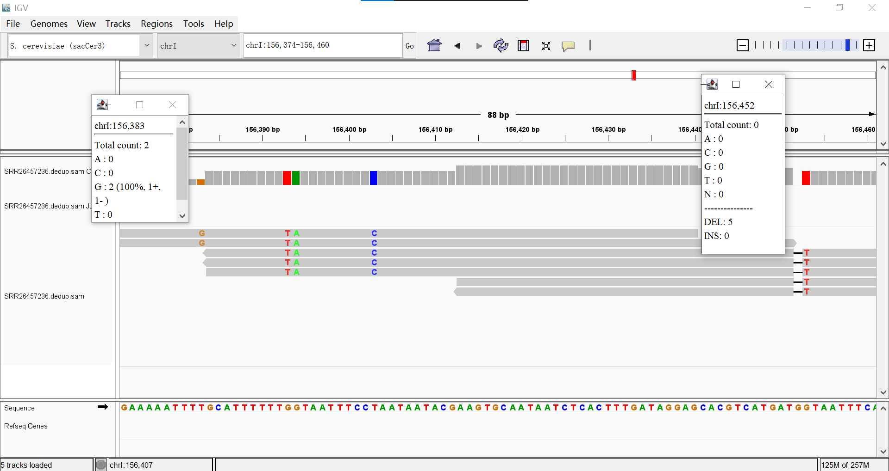

<central> 图15. Coverage track的覆盖度 </central>

​	在Splice junction track中，来自于Junction 来自于正链用红色表示，来自于负链使用蓝色表示，如下图所示。另外，在Alignment track中，黑色横线表示有缺失，且横线上的数字表示缺失碱基的个数（如上图表示5个碱基的缺失）；紫色的“I”表示Insertions（插入），如下图中“I3”表示有3个碱基的插入；若所有的reads中某个位点与参考基因组均不一致（如下图的蓝色“C”），则该位点可能为SNP突变。

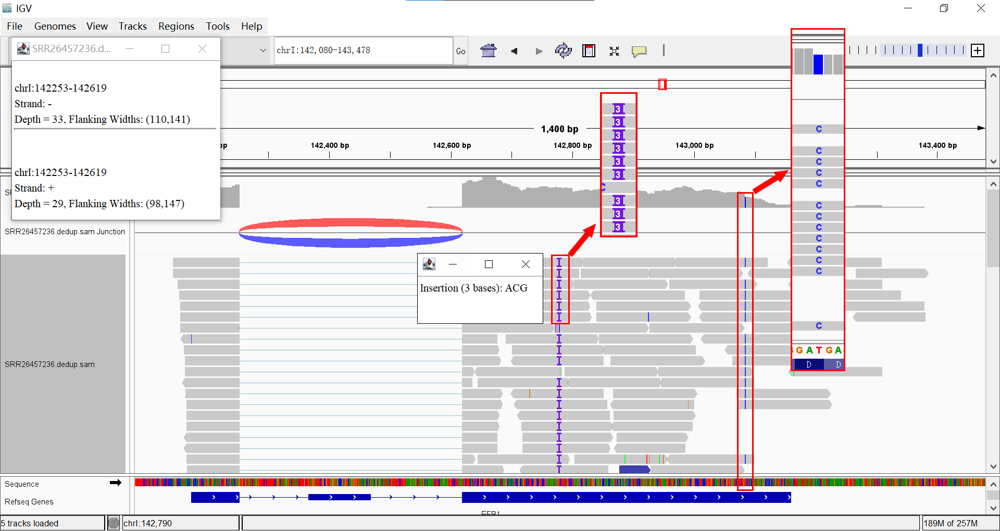

<central> 图16. Splice junction track及Alignment track的含义 </central>

​	另外，通过设置“Color aligments by -> read strand”和“Group aligments by -> first-in-pair strand”，如下图所示，正链基因的read pair方向性为F1R2（表示第一链（F1）代表正链，第二链（R2）代表负链），而负链基因的read pair方向性为F2R1，表明该RNAseq数据是用dUTP 链特异性建库的。


<central> 图17. 确定RNAseq建库方法 </central>

#### 4.2 R统计可视化

```bash
#创建fasta的索引文件
xuyinan@xlinux:~/shengxing/Lvjihong/STAR_homework$ samtools faidx Saccharomyces_cerevisiae.R64-1-1.dna.toplevel.fa

#变异位点分析
xuyinan@xlinux:~/shengxing/Lvjihong/STAR_homework$ freebayes -p 2 -f Saccharomyces_cerevisiae.R64-1-1.dna.toplevel.fa SRR26457236.dedup.bam > SRR26457236.freebayes.vcf
```

> -p：研究物种的染色体倍数（默认为2） 
>
> -f：参考基因组（需有FILE.fai格式的索引文件）

```bash
#查看.vcf文件
xuyinan@xlinux:~/shengxing/Lvjihong/STAR_homework$ cat SRR26457236.freebayes.vcf|head -70
```

```
##fileformat=VCFv4.2
##fileDate=20231026
##source=freeBayes v1.3.6
##reference=Saccharomyces_cerevisiae.R64-1-1.dna.toplevel.fa
##contig=<ID=I,length=230218>
##contig=<ID=II,length=813184>
##contig=<ID=III,length=316620>
##contig=<ID=IV,length=1531933>
##contig=<ID=V,length=576874>
##contig=<ID=VI,length=270161>

...

#CHROM  POS     ID      REF     ALT     QUAL    FILTER  INFO    FORMAT  unknown                                                                  I       475     .       AGATTCC AC      58.2778 .       AB=0;ABP=0;AC=2;AF=1;AN=2;AO=2;CIGAR=1M5D1M;DP=2;DPB=0.571429;DPRA=0;EPP=3.0103;EPPR=0;GTI=0;LEN=5;MEANALT=1;MQM=255;MQMR=0;NS=1;NUMALT=1;ODDS=5.43185;PAIRED=1;PAIREDR=0;PAO=0;PQA=0;PQR=0;PRO=0;QA=74;QR=0;RO=0;RPL=0;RPP=7.35324;RPPR=0;RPR=2;RUN=1;SAF=1;SAP=3.0103;SAR=1;SRF=0;SRP=0;SRR=0;TYPE=del  GT:DP:AD:RO:QR:AO:QA:GL 1/1:2:0,2:0:0:2:74:-7.03,-0.60206,0                      I       485     .       TCAC    CCAA    55.4278 .       AB=0;ABP=0;AC=2;AF=1;AN=2;AO=2;CIGAR=1X2M1X;DP=2;DPB=2;DPRA=0;EPP=3.0103;EPPR=0;GTI=0;LEN=4;MEANALT=1;MQM=255;MQMR=0;NS=1;NUMALT=1;ODDS=5.43185;PAIRED=1;PAIREDR=0;PAO=0;PQA=0;PQR=0;PRO=0;QA=71;QR=0;RO=0;RPL=0;RPP=7.35324;RPPR=0;RPR=2;RUN=1;SAF=1;SAP=3.0103;SAR=1;SRF=0;SRP=0;SRR=0;TYPE=complex     GT:DP:AD:RO:QR:AO:QA:GL 1/1:2:0,2:0:0:2:71:-6.745,-0.60206,0                     
```

​	文件头部信息是整体注释信息，以##作为起始，其后一般接以FILTER，INFO，FORMAT等字样；主体信息共有10列，整理如下：

| CHROM | POS  |  ID  |   REF   | ALT  |  QUAL   | FILTER |                             INFO                             |         FORMAT          |          unknown          |
| :---: | :--: | :--: | :-----: | :--: | :-----: | :----: | :----------------------------------------------------------: | :---------------------: | :-----------------------: |
|   I   | 475  |  .   | AGATTCC |  AC  | 58.2588 |   .    | AB=0;ABP=0;AC=1;AF=1;AN=1;AO=2;CIGAR=1M5D1M;DP=2;DPB=0.571429;DPRA=0;EPP=3.0103;EPPR=0;GTI=0;LEN=5;MEANALT=1;MQM=255;MQMR=0;NS=1;NUMALT=1;ODDS=13.4146;PAIRED=1;PAIREDR=0;PAO=0;PQA=0;PQR=0;PRO=0;QA=74;QR=0;RO=0;RPL=0;RPP=7.35324;RPPR=0;RPR=2;RUN=1;SAF=1;SAP=3.0103;SAR=1;SRF=0;SRP=0;SRR=0;TYPE=del | GT:DP:AD:RO:QR:AO:QA:GL | 1:2:0,2:0:0:2:74:-7.03,0  |
|   I   | 485  |  .   |  TCAC   | CCAA | 55.4088 |   .    | AB=0;ABP=0;AC=1;AF=1;AN=1;AO=2;CIGAR=1X2M1X;DP=2;DPB=2;DPRA=0;EPP=3.0103;EPPR=0;GTI=0;LEN=4;MEANALT=1;MQM=255;MQMR=0;NS=1;NUMALT=1;ODDS=12.7583;PAIRED=1;PAIREDR=0;PAO=0;PQA=0;PQR=0;PRO=0;QA=71;QR=0;RO=0;RPL=0;RPP=7.35324;RPPR=0;RPR=2;RUN=1;SAF=1;SAP=3.0103;SAR=1;SRF=0;SRP=0;SRR=0;TYPE=complex | GT:DP:AD:RO:QR:AO:QA:GL | 1:2:0,2:0:0:2:71:-6.745,0 |
|   I   | 509  |  .   |    G    |  A   | 58.2588 |   .    | AB=0;ABP=0;AC=1;AF=1;AN=1;AO=2;CIGAR=1X;DP=2;DPB=2;DPRA=0;EPP=7.35324;EPPR=0;GTI=0;LEN=1;MEANALT=1;MQM=255;MQMR=0;NS=1;NUMALT=1;ODDS=13.4146;PAIRED=1;PAIREDR=0;PAO=0;PQA=0;PQR=0;PRO=0;QA=74;QR=0;RO=0;RPL=1;RPP=3.0103;RPPR=0;RPR=1;RUN=1;SAF=1;SAP=3.0103;SAR=1;SRF=0;SRP=0;SRR=0;TYPE=snp | GT:DP:AD:RO:QR:AO:QA:GL | 1:2:0,2:0:0:2:74:-7.03,0  |
|   I   | 519  |  .   |   CAA   | TAG  | 58.2588 |   .    | AB=0;ABP=0;AC=1;AF=1;AN=1;AO=2;CIGAR=1X1M1X;DP=2;DPB=2;DPRA=0;EPP=3.0103;EPPR=0;GTI=0;LEN=3;MEANALT=1;MQM=255;MQMR=0;NS=1;NUMALT=1;ODDS=13.4146;PAIRED=1;PAIREDR=0;PAO=0;PQA=0;PQR=0;PRO=0;QA=74;QR=0;RO=0;RPL=2;RPP=7.35324;RPPR=0;RPR=0;RUN=1;SAF=1;SAP=3.0103;SAR=1;SRF=0;SRP=0;SRR=0;TYPE=complex | GT:DP:AD:RO:QR:AO:QA:GL | 1:2:0,2:0:0:2:74:-7.03,0  |

​	各列含义如下：

 	1. CHROM：染色体编号；
 	2. POS：变异位点在参考基因组中的位置。如果是SNP的话，POS即SNP的位置；如果是INDEL（insertion or deletion，小片段序列的插入或删除）的话，位置是INDEL的第一个碱基位置；
 	3. ID：SNP/INDEL的ID（一般只有人类基因组才有dbSNP编号，若没有，则用’.'表示）；
 	4. REF：参考基因组该位置碱基类型；
 	5. ALT：与参考序列比较，发生突变的变异碱基类型；
 	6. QUAL：变异位点检测质量值，其值为-10*log10(该变异位点检测错误的概率)。因此该值越高越可靠。
 	7. FILTER：过滤情况，如果该位点通过过滤标准，则为"PASS"，说明该列质量值高；否则为“.”；
 	8. INFO：variant的详细信息；
 	9. FORMAT：后面第10列信息的说明列；
 	10. unknown：样品基因型列，与FORMAT列一一对应。

```bash
#导出主体信息
xuyinan@xlinux:~/shengxing/Lvjihong/STAR_homework$  cat SRR26457236.freebayes.vcf | grep -v '##' > CallVariants.txt   
```

```R
#导包及读取文件
setwd('C:/Users/lvjih/Desktop/')

library(dplyr)
library(ggplot2)
library(cowplot)

vcf <- read.delim('CallVariants.txt',header = T) 


vcf <- vcf %>% rename(CHROM = X.CHROM) %>% 
  subset(select = c(CHROM, REF, ALT, QUAL)) 
```

```R
#统计每条染色体的变异数
vcf_chr <- vcf %>% count(CHROM) %>% 
  mutate(CHROM = factor(CHROM, levels=c('I','II','III','IV','V' ,'VI','VII','VIII','IX','X','XI','XII','XIII','XIV','XV','XVI'))) %>% 
  rename(NUM = n)

chr_plot <- ggplot(vcf_chr, aes(x=CHROM, y=NUM))+
  geom_segment(aes(x=CHROM,xend=CHROM,y=0,yend=NUM))+
  geom_point(size=3,shape=21,fill='red')+
  theme_cowplot()
chr_plot

ggsave(filename='chr_plot.jpg',chr_plot, width = 8, height = 5)
```


<central> 图18. 染色体的变异数统计 </central>

​	可见，4、7、12、15号染色体上变异数远大于1、3、6号染色体，其中4号染色体变异数最大，3号染色体变异数最小。这可能与染色体的长度有一定的关系，因为如下图所示，1、3、6号染色体的长度明显小于其他染色体。


<central> 图19. 酿酒酵母各染色体大小 </central>

```R
#统计变异位点检测质量值的分布
Qual_cut <- table(cut(vcf$QUAL, 
                      breaks = c(seq(0,100,by=10),Inf),
                      labels = c('<10',"10~20",'20~30',"30~40",'40~50','50~60','60~70','70~80','80~90','90~100','>100')))
qual_plot <- ggplot(data.frame(Qual_cut)) +
  geom_bar(aes(x=Var1, y=Freq), stat = "identity")+
  geom_text(aes(x = Var1, y = Freq,label=Freq), vjust = -0.5)+
  xlab("QUAL")+
  ylab("Counts")+
  theme_cowplot()

ggsave('Qual_polt.jpg',qual_plot,width = 10, height = 5)

```

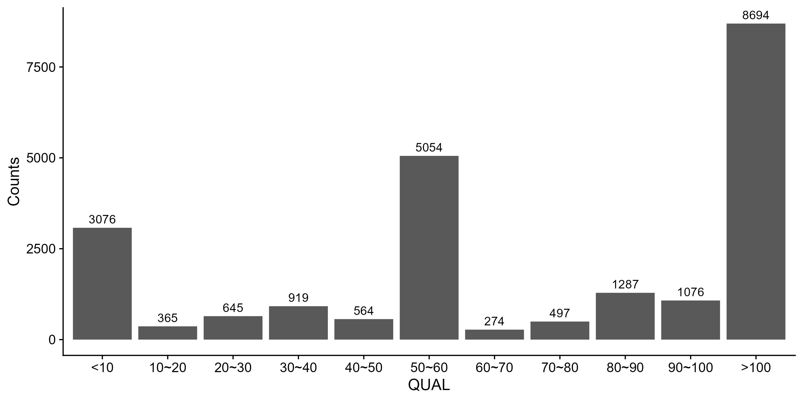

<central> 图20. 变异位点检测质量值的分布 </central>

​	可以看出质量值较低的变异数比较少。一般情况下需要舍弃质量值低于20的变异位点，因为此时检测错误的概率大于10^-2^，可信度不高。


<central> - End - </central>
